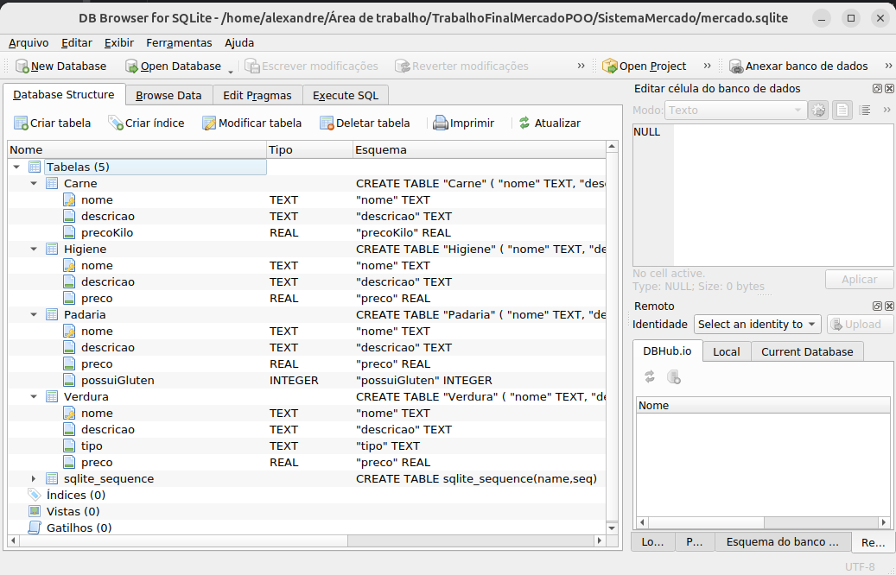

Tópicos: 
1. Fiz com o padrão do professor, o nome é o PK
2. Usei IA para tarefas repetitivas, por exemplo, criei o cadastro edição e busca da carne na mão, mostrei o processo pra IA e pedi para ela fazer
3. A ideia inicial seria fazer os 2 projetos, do CRUD e do cliente criar uma compra, mas percebi que o CRUD de produtos (aparentemente) supria 
os entregáveis e como tinha a semana do GTI e acabei participando (e ganhando hehe) do hackaton gastei um tempo precioso na semana que mais iria
dedicar ao trabalho
4. Tentei repetir os métodos REST, como o próprio CRUD Post, Patch, Get(geral e por "id") e Delete no pacote "Controle", como cada classe-categoria
tem infos e métodos próprios acabei criando um método para cada.
5. Classe abstrata produto, sinceramente eu não sei mas acho que poderia (e acho) que deveria usá-la como interface, mas como tinha que ter classe
abstrata eu fiz assim, criei as interfaces só pra falar que tem praticamente, mas acho que está pelo menos implementada corretamente
6. Rememorei/reaprendi algumas coisas novamente com a IA que acabei implementando, como o uso de : para ver percorrer uma lista e o printf do java, que 
tinha esquecido
7. Gostei muito de fazer a atividade, apesar de ter sido beeem cansativo, e ter apelado pra IA pra repetir processos (acho que foi OK, acredito que 
aprendi bem) foi massa entender como fazer a IDE conversar com o banco, principalmente com a parte do SQL
8. No início achei que não conseguiria fazer um sistema que criasse as categorias, subcategorias e produtos como o primeiro trabalho utilizando
abstrações e o banco, com abstração e classe como é no Java acho que não conseguiria, mas com banco depois percebi que daria muito bem, criando uma
tabela para cada Categoria, e subcategoria, e dando X opções pro usuário escolher cada peculiaridade de cada categoria etc, mas não existirião as classes
"Carne", "Higiene" mas sim apenas tabelas no banco, o que funcionaria mas talvez não estivesse completamente certo, pelo menos pra POO.
9. Pedi para o GPT popular as tabelas para simular um caso "real"
10. Utilizei um método de combinação de Classe-Função para ver o que o usuário quer fazer, por exemplo Cadastrar Carne ficou como CC internamente,
para não ter que criar muitos métodos iguais (existem as mesmas opções para carne, higiene, etc)

Print do banco:

